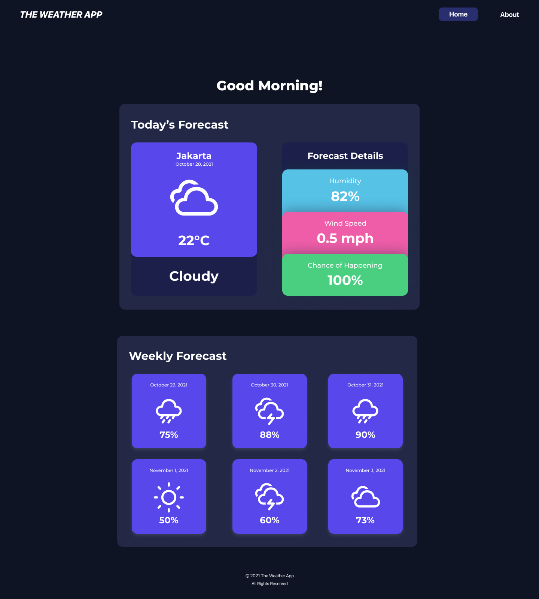

# the-weather-app

## Welcome! 👋

Thanks for checking out this project.

This is my first project on GitHub, originally submitted as a final project for the Coding Extracurricular in my High School. This project is created as an assesment after learning basic Front-End Development for approx. 3 months. It's not perfect, but there's this german proverb that I like, "Der erste Pfannkuchen wird niemals perfekt sein" (in english: the first pancake will never be perfect") 👌.

Every part of this project is an example code which shows how to do the following:

* Create a webpage baseline using HTML
* Design the pages using external CSS, Flexbox and Bootstrap
* Fetch APIs and manipulate DOM using JavaScript

## Found a bug?

If you found an issue or would like to submit an improvement to this project, please submit an issue using the issues tab above.

## Like this project?

If you are feeling generous, buy me a coffee! - [https://www.buymeacoffee.com/aaron_raf/](https://buymeacoffee.com/aaron_raf)

Cheers! ✌️😄
